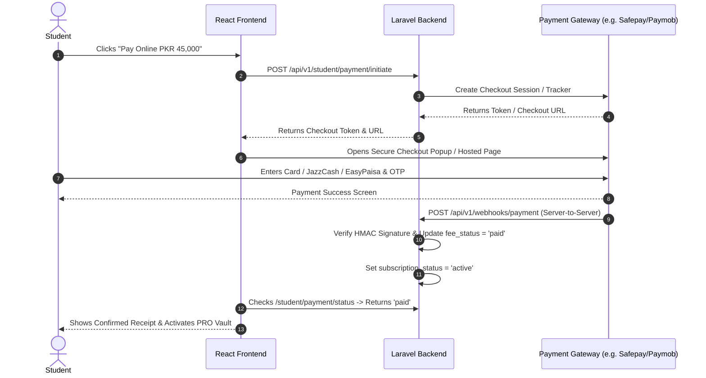

# Complete Step-by-Step Payment Gateway Integration Guide
### For Orbon Consultancy (Laravel 12 Backend + React SPA Frontend)

Yeh guide aapko aapke platform par real payment gateway integrate karne ka mukammal tareeqa samjhati hai — gateway select karne se lekar backend code, webhooks, frontend checkout aur live testing tak.

---

## Table of Contents
1. [Kaun sa Gateway Select Karein?](#1-kaun-sa-gateway-select-karein)
2. [Legal & Business Requirements (Documents)](#2-legal--business-requirements)
3. [Architecture & Payment Flow](#3-architecture--payment-flow)
4. [Step 1: Database Setup (Payments Table)](#step-1-database-setup-payments-table)
5. [Step 2: Environment Variables (.env)](#step-2-environment-variables-env)
6. [Step 3: Laravel Backend Implementation](#step-3-laravel-backend-implementation)
7. [Step 4: Frontend React Checkout Integration](#step-4-frontend-react-checkout-integration)
8. [Step 5: Webhooks & Automatic Fee Activation](#step-5-webhooks--automatic-fee-activation)
9. [Step 6: Sandbox Testing & Go-Live Checklist](#step-6-sandbox-testing--go-live-checklist)

---

## 1. Kaun sa Gateway Select Karein?

Aapki application mein fee **PKR 45,000** hai.

| Gateway | Supported Methods | Target Audience | Suitability for Orbon |
| :--- | :--- | :--- | :--- |
| **Safepay** | Pakistani Visa/Mastercard, JazzCash, EasyPaisa, PayFast | Pakistani Students | ⭐ **Sab se behtareen (Recommended)**: Quick setup, modern JS checkout SDK, direct PKR settlements |
| **Paymob Pakistan** | Visa, Mastercard, JazzCash, EasyPaisa, Bank Alfalah Wallets | Pakistani Students | ⭐ **Bohat acha**: SBP registered, widespread adoption in Pakistan |
| **Lemon Squeezy** | International Credit/Debit Cards, Apple Pay, Google Pay | Overseas / International Students | ⭐ **Best for Foreign Students**: Merchant of Record, Pakistan se direct account ban jata hai |
| **Stripe** | Dunya bhar ke cards | Global | Requires US LLC / UK LTD / Stripe Atlas (Pakistan mein direct allow nahi) |

---

## 2. Legal & Business Requirements

Sandbox/Test mode ke liye sirf email signup chahiye hota hai, lekin **Live Transactions** ke liye gateway provider yeh maangta hai:

1. **Business Verification:**
   - NTN Certificate (FBR Sole Proprietorship ya Private Limited)
   - Business Bank Account Title (Company / Consultant name par)
   - Owner ka CNIC & Mobile Number
2. **Website Compliance:**
   - **Terms of Service** (`/terms`)
   - **Privacy Policy** (`/privacy`)
   - **Refund / Cancellation Policy** (`/refund-policy`) - Wazahut karein ke 45,000 PKR consultancy fee non-refundable hai ya conditions kya hain
   - Contact Us page par physical address aur official phone/email

---

## 3. Architecture & Payment Flow



---

## Step 1: Database Setup (Payments Table)

Aapke paas already `users` table mein `fee_status` aur `payment_reference` mojood hain. Real gateway ke transaction records aur audit trail ke liye ek dedicated `payments` table banani chahiye.

Run in `backend/`:
```bash
php artisan make:migration create_payments_table
```

Migration File:
```php
<?php

use Illuminate\Database\Migrations\Migration;
use Illuminate\Database\Schema\Blueprint;
use Illuminate\Support\Facades\Schema;

return new class extends Migration
{
    public function up(): void
    {
        Schema::create('payments', function (Blueprint $table) {
            $table->id();
            $table->foreignId('user_id')->constrained()->cascadeOnDelete();
            $table->string('gateway'); // e.g. 'safepay', 'paymob', 'stripe'
            $table->string('transaction_id')->nullable()->unique();
            $table->string('order_tracker')->nullable()->index();
            $table->decimal('amount', 10, 2);
            $table->string('currency', 10)->default('PKR');
            $table->enum('status', ['pending', 'completed', 'failed', 'refunded'])->default('pending');
            $table->string('payment_method')->nullable(); // card, jazzcash, easypaisa
            $table->json('metadata')->nullable();
            $table->timestamp('paid_at')->nullable();
            $table->timestamps();
        });
    }

    public function down(): void
    {
        Schema::dropIfExists('payments');
    }
};
```

Run migration:
```bash
php artisan migrate
```

---

## Step 2: Environment Variables (.env)

`backend/.env` mein gateway keys add karein:

```env
# PAYMENT GATEWAY (Safepay Example)
PAYMENT_GATEWAY=safepay
SAFEPAY_ENVIRONMENT=sandbox # change to 'production' when live
SAFEPAY_API_KEY=sec_test_xxxxxxxxxxxxxxxxxxxx
SAFEPAY_PUBLIC_KEY=pub_test_xxxxxxxxxxxxxxxxxxxx
SAFEPAY_WEBHOOK_SECRET=whsec_xxxxxxxxxxxxxxxxxxxx

# FRONTEND RETURN URL
FRONTEND_PAYMENT_SUCCESS_URL=http://localhost:5173/student/apply-for-me?payment=success
FRONTEND_PAYMENT_CANCEL_URL=http://localhost:5173/student/apply-for-me?payment=cancel
```

---

## Step 3: Laravel Backend Implementation

### 1. PaymentController create karein:
`backend/app/Http/Controllers/Api/V1/Payment/PaymentGatewayController.php`

```php
<?php

namespace App\Http\Controllers\Api\V1\Payment;

use App\Http\Controllers\Controller;
use App\Models\Payment;
use App\Models\Notification;
use Illuminate\Http\JsonResponse;
use Illuminate\Http\Request;
use Illuminate\Support\Facades\Http;
use Illuminate\Support\Facades\Log;

class PaymentGatewayController extends Controller
{
    /**
     * Initiate Payment (Create Checkout Session)
     */
    public function initiate(Request $request): JsonResponse
    {
        $user = $request->user();
        $amount = 45000; // PKR 45,000 Consultancy Fee

        // 1. Database record create karein
        $payment = Payment::create([
            'user_id' => $user->id,
            'gateway' => config('services.safepay.gateway', 'safepay'),
            'amount' => $amount,
            'currency' => 'PKR',
            'status' => 'pending',
            'order_tracker' => 'ORB-' . time() . '-' . $user->id,
        ]);

        // 2. Gateway API call (Safepay Example)
        $baseUrl = config('services.safepay.env') === 'production'
            ? 'https://api.getsafepay.com'
            : 'https://sandbox.api.getsafepay.com';

        try {
            $response = Http::withHeaders([
                'X-SFPY-MERCHANT-SECRET' => config('services.safepay.api_key'),
            ])->post("{$baseUrl}/order/v1/init", [
                'client' => config('services.safepay.api_key'),
                'amount' => $amount * 100, // paisas (in cents/paisas)
                'currency' => 'PKR',
                'environment' => config('services.safepay.env', 'sandbox'),
            ]);

            if ($response->successful()) {
                $tracker = $response->json('data.token');
                $payment->update(['order_tracker' => $tracker]);

                // Checkout URL create karein
                $checkoutUrl = "https://sandbox.api.getsafepay.com/components?env=sandbox&beacon={$tracker}&source=custom";

                return response()->json([
                    'status' => 'success',
                    'tracker' => $tracker,
                    'checkout_url' => $checkoutUrl,
                    'payment_id' => $payment->id,
                ]);
            }

            return response()->json(['message' => 'Failed to initialize payment gateway.'], 500);
        } catch (\Exception $e) {
            Log::error('Payment initiation error: ' . $e->getMessage());
            return response()->json(['message' => 'Payment server error: ' . $e->getMessage()], 500);
        }
    }

    /**
     * Webhook Handler (Gateway notifies backend when payment succeeds)
     */
    public function handleWebhook(Request $request): JsonResponse
    {
        $payload = $request->all();
        $signature = $request->header('X-SFPY-SIGNATURE');

        Log::info('Payment webhook received', $payload);

        // Verify HMAC signature to protect from fraud
        $computed = hash_hmac('sha256', $request->getContent(), config('services.safepay.webhook_secret'));
        if (! hash_equals($computed, (string)$signature)) {
            Log::warning('Invalid webhook signature');
            return response()->json(['message' => 'Invalid signature'], 400);
        }

        // Process successful payment
        if (($payload['data']['status'] ?? '') === 'PAID') {
            $tracker = $payload['data']['token'] ?? null;
            $payment = Payment::where('order_tracker', $tracker)->first();

            if ($payment && $payment->status !== 'completed') {
                $payment->update([
                    'status' => 'completed',
                    'transaction_id' => $payload['data']['reference'] ?? ('TRX-' . uniqid()),
                    'paid_at' => now(),
                    'metadata' => $payload,
                ]);

                // User profile update karein
                $user = $payment->user;
                $user->update([
                    'fee_status' => 'paid',
                    'fee_paid_at' => now(),
                    'subscription_status' => 'active',
                    'payment_reference' => $payment->transaction_id,
                ]);

                Notification::notify(
                    $user->id,
                    'Fee Payment Received Online!',
                    'Your payment of PKR 45,000 has been verified automatically. Admission processing is active.',
                    'fee_update',
                    '/student/apply-for-me'
                );
            }
        }

        return response()->json(['status' => 'ok']);
    }
}
```

### 2. Routes register karein (`routes/api.php`):
```php
// Student payment initiation (requires auth)
Route::middleware('auth:sanctum')->group(function () {
    Route::post('student/payment/initiate', [PaymentGatewayController::class, 'initiate']);
});

// Gateway Webhook (NO auth:sanctum, Gateway directly posts here)
Route::post('webhooks/payment', [PaymentGatewayController::class, 'handleWebhook']);
```

---

## Step 4: Frontend React Checkout Integration

`frontend-react/src/pages/student/ApplyForMePage.jsx` mein mock timer ko real backend API call se replace karein:

### 1. API helper add karein (`frontend-react/src/api/premium.js`):
```javascript
export async function initiateOnlinePayment() {
  const response = await api.post('/v1/student/payment/initiate');
  return response.data;
}
```

### 2. Checkout Button Trigger (`ApplyForMePage.jsx`):
```jsx
const handleInitiateRealPayment = async () => {
  setProcessingPayment(true);
  try {
    const res = await initiateOnlinePayment();

    if (res.checkout_url) {
      // Option A: Direct Redirect to Gateway Hosted Checkout
      window.location.href = res.checkout_url;

      // Option B: Safepay Popup Modal (using Safepay Checkout Script)
      // window.Safepay.checkout.open({ tracker: res.tracker });
    }
  } catch (err) {
    alert(err.message || 'Payment failed to initiate.');
  } finally {
    setProcessingPayment(false);
  }
};
```

---

## Step 5: Webhooks & Security Checklist

Real payment gateways mein **Frontend return page par kabhi bhi user ka account activate nahi karna chahiye**, kyunke koi bhi student browser inspect karke return URL direct open kar sakta hai.

Hamesha **Webhook** ke zariye activate karein:
1. **HMAC Signature Check**: Webhook ka secret key match karein.
2. **Idempotency**: Ek hi transaction do martaba credit na ho.
3. **SSL/HTTPS**: Production par SSL (`https://`) lazmi hona chahiye warna gateways live webhook deliver nahi karte.
4. **Local Testing Webhook**: Localhost par webhook test karne ke liye **ngrok** use karein:
   ```bash
   ngrok http 8000
   # ngrok url mil jayega, e.g. https://abc123.ngrok-free.app/api/v1/webhooks/payment
   # Is url ko Safepay/Paymob developer portal mein webhook endpoint set karein.
   ```

---

## Step 6: Sandbox Testing & Go-Live Checklist

### Test Cards (Safepay Sandbox):
* **Card Number:** `4000 0000 0000 0001` (Success test)
* **Expiry:** Future date (e.g. `12/28`)
* **CVV:** `123`
* **OTP:** `123456`

### Production Go-Live Steps:
1. [ ] Merchant Portal par KYC documents submit karein.
2. [ ] Provider approval ke baad **Production Secret & Public Keys** generate karein.
3. [ ] Server ke `.env` mein `SAFEPAY_ENVIRONMENT=production` set karein.
4. [ ] VPS / Hostinger par Webhook URL set karein: `https://api.yourdomain.com/api/v1/webhooks/payment`.
5. [ ] 1 real live test transaction karein (e.g. PKR 100 ya test refund transaction) taake verification confirm ho jaye.

---

Aap chahein to hum sab se pehle **Safepay Sandbox** ya **Paymob** ka backend structure aapke codebase mein integrate karna start kar sakte hain!
